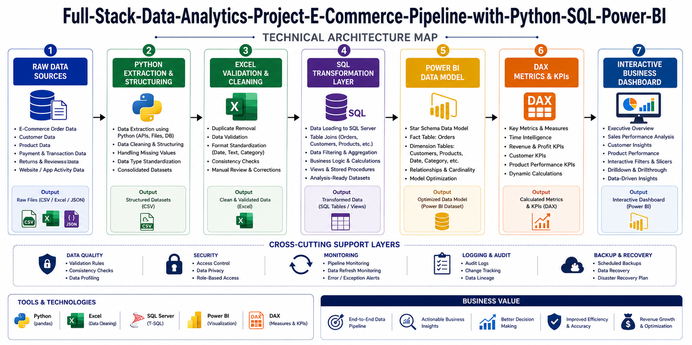
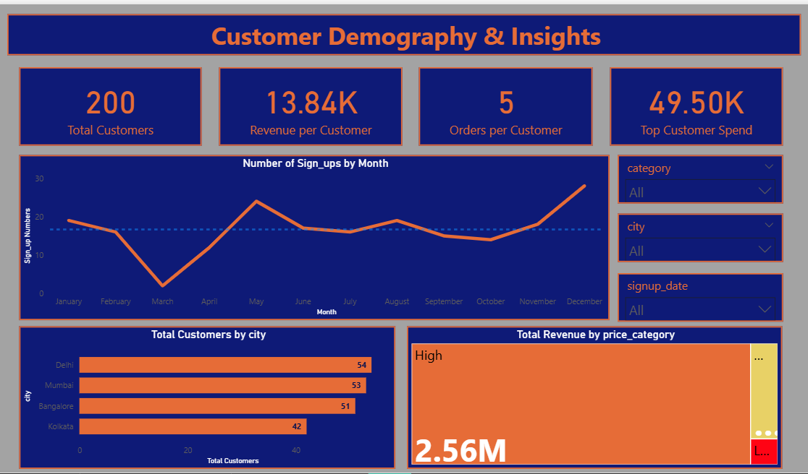
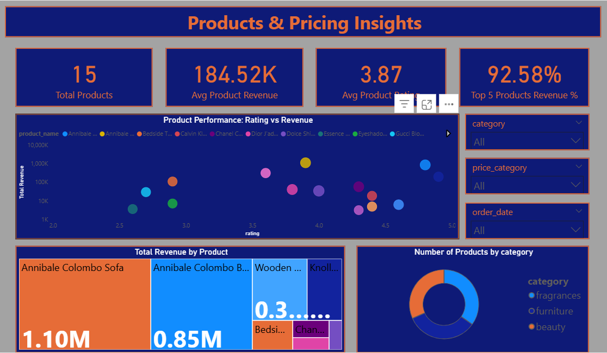

# 💼 E-Commerce Data Pipeline & Intelligence Dashboard

> An end-to-end analytics project that transforms raw e-commerce data into business decisions — combining Python, SQL, and Power BI into a single workflow.

[](https://python.org)
[](https://www.microsoft.com/sql-server)
[](https://powerbi.microsoft.com)
[](https://microsoft.com/excel)

---

## 📌 Business Problem

A growing e-commerce business needed clarity on **why revenue looked healthy but growth felt fragile**. This pipeline was built to move from raw transactional records to structured business intelligence — and surface the concentration risks hiding beneath strong top-line metrics.

**Dataset:** ~50,000 synthetic order records across 3 source files (Orders, Customers, Products), simulating 18 months of e-commerce activity.

---

## 🔍 Key Findings

| Signal | Finding |
|--------|---------|
| 🔴 Category risk | Electronics drives ~47% of revenue from a fraction of total SKUs |
| 🟡 Acquisition gap | Strong repeat-purchase rates masking weak new customer growth |
| 🟢 Geographic opportunity | Revenue concentrated in metros; tier-2 markets underdeveloped |

---

## 🛠️ Tech Stack


---

## ⚙️ Architecture



```
Raw Data ──► Python ──► Excel ──► SQL Server ──► Power BI
            Schema    Business   Transformation  Intelligence
            & Validation  Sign-off   & Modeling   Dashboard
```

> Transformation logic was intentionally centralised in SQL to keep the BI layer lightweight, auditable, and performant.

---

## 📸 Dashboard Preview

### Sales Performance


### Customer Behaviour


### Product Performance


---

## 📈 Key KPIs

| KPI | Description |
|-----|-------------|
| Total Revenue | Overall business revenue |
| Average Order Value (AOV) | Revenue per order |
| Repeat Customer Rate | Retention indicator |
| Revenue Growth % MoM | Month-over-month growth |
| Revenue per Customer | Average customer value |

---

## 🧱 Technical Workflow

| Layer | Tool | Key Work |
|-------|------|----------|
| 1 | Python | Schema validation, null-key detection, typed CSV exports |
| 2 | Excel | Duplicate removal, ISO 8601 date standardisation, business validation checkpoint |
| 3 | SQL Server | Joins, aggregations, window functions, repeat-customer views |
| 4 | Power BI | Star schema modelling, single-direction relationships, KPI dashboards |
| 5 | DAX | Filter-safe measures for revenue, growth, retention, and AOV |

**Star Schema (Power BI):**

```
                    ┌─────────────┐
                    │  dim_Date   │
                    └──────┬──────┘
                           │
┌──────────────┐    ┌──────┴──────┐    ┌───────────────┐
│ dim_Customer ├────┤ fact_Orders ├────┤  dim_Product  │
└──────────────┘    └─────────────┘    └───────────────┘
```

> A star schema with conformed dimensions and surrogate keys prevents the silent DAX calculation errors that arise from poorly modelled flat tables.

**DAX — Core Measures:**

```dax
-- Month-over-Month Revenue Growth
Revenue Growth % MoM =
VAR PriorMonth = CALCULATE([Total Revenue], DATEADD(dim_Date[Date], -1, MONTH))
RETURN DIVIDE([Total Revenue] - PriorMonth, PriorMonth, 0)
```

Other measures built: `Repeat Customer Rate`, `Average Order Value`, `Revenue per Customer` — all using explicit `CALCULATE` scoping to prevent filter context bleed.

---

## 💡 Business Insights

- **Electronics** contributes ~47% of total revenue, creating meaningful category concentration risk
- Revenue is driven by a **small subset of SKUs**, indicating weak catalogue discoverability
- **Repeat purchase rates are strong**, but new-customer acquisition appears comparatively stagnant
- Revenue clusters in **major metro areas**, with tier-2 and tier-3 cities underdeveloped relative to population

**Recommended Actions:**

| Priority | Recommendation |
|----------|---------------|
| 🔴 High | Diversify category revenue mix |
| 🔴 High | Invest in new customer acquisition |
| 🟡 Medium | Improve product discoverability |
| 🟡 Medium | Expand geographic reach into tier-2 cities |
| 🟢 Low | Improve funnel-stage and attribution data capture |

---

## ⚡ Challenges Solved

| Challenge | Approach |
|-----------|----------|
| Duplicate order records | Deduplication via composite key (`order_id + customer_id + timestamp`) before SQL load |
| Inconsistent date formats | Standardised to ISO 8601 in Excel; enforced with `CAST` on SQL ingestion |
| Slow Power BI refresh | Pre-aggregated SQL views; report layer reads views, not raw tables |
| DAX filter context drift | Explicit `CALCULATE + REMOVEFILTERS` scoping on all revenue measures |
| Schema mismatches across files | Python pre-validation enforces column types before downstream load |

---

## 🔮 Roadmap

**Customer Cohort Analysis** — SQL-based acquisition model to track new-user growth separately from repeat-purchase behaviour. Current metrics make both look healthy; cohort tracking separates them.

**Pipeline Orchestration (Apache Airflow)** — Schedule and monitor each pipeline stage as dependent tasks with failure alerting.

**Churn Prediction (Prophet / scikit-learn)** — Score customers by churn probability using recency, frequency, and category signals.

---

## 📁 Project Structure

```
ecommerce-pipeline/
│
├── data/
│   ├── raw/                  # Original source files (unmodified)
│   └── processed/            # Post-Python, post-Excel cleaned files
│
├── python/
│   └── data_collection.py    # Ingestion, schema validation, export
│
├── sql/
│   ├── transformations.sql   # Joins, aggregations, business logic views
│   └── schema.sql            # Table definitions and index strategy
│
├── dashboard/
│   └── ecommerce_report.pbix # Power BI report file
│
├── assets/
│   ├── tech-architecture.png
│   ├── sales-performance.png
│   ├── customer-behavior.png
│   └── product-performance.png
│
└── docs/
    └── insight-summary.md    # Plain-language findings for non-technical stakeholders
```

---

## 🎯 Final Perspective

This project demonstrates how raw transactional data can be transformed into actionable business intelligence through structured engineering, analytical modelling, and executive-focused reporting.

The next analytical question this data points to: a **customer acquisition cohort model** in SQL — built to separate retention performance from new-user growth. The current metrics make both look healthy, but they are measuring different kinds of health.

---
## 📘 Detailed Documentation

For complete technical implementation details:

➡️ [View Full Technical Documentation](Docs/technical-readme.md)

---

## 👤 Author

**Md Yusuf**
Data Analyst | SQL · Power BI · Python · Excel

[](https://linkedin.com/in/YOUR-PROFILE-SLUG)
[](https://github.com/YOUR-USERNAME)

*If this project was useful or interesting, a ⭐ on the repo is appreciated.*
