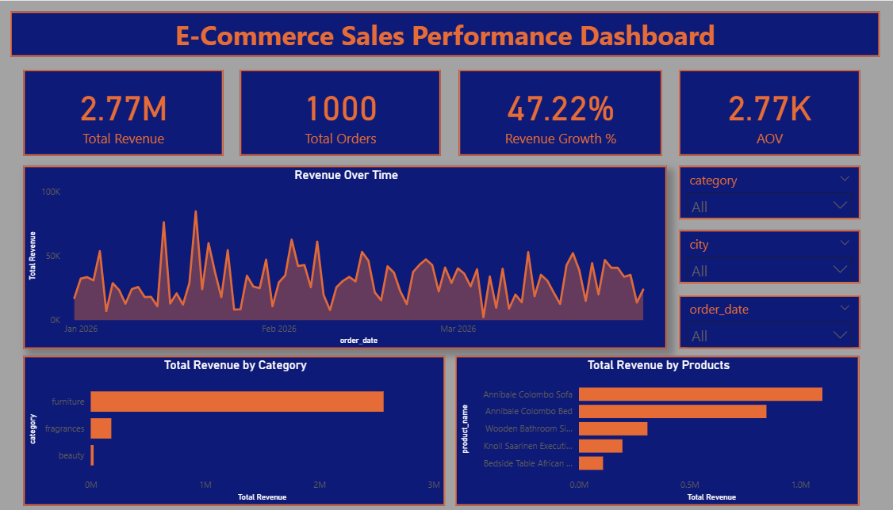

# 💼 E-Commerce Data Pipeline & Intelligence Dashboard

🚀 An end-to-end analytics project that transforms raw e-commerce data into business decisions — combining **Python, SQL, and Power BI** into a single workflow.

---

## 📌 Project Overview
An end-to-end e-commerce analytics pipeline built across Python → Excel → SQL Server → Power BI, transforming raw, multi-source transactional data into a boardroom-ready intelligence dashboard.
The pipeline surfaces three high-signal business findings:

🔴 Category concentration risk — Electronics drives ~47% of revenue from a small fraction of total SKUs

🟡 Retention vs. acquisition imbalance — Strong repeat-purchase rates masking weak new customer growth

🟢 Untapped geographic demand — Revenue heavily concentrated in metros; tier-2 markets underdeveloped


This project was designed not just to show what happened — but to explain why it matters and what to do next.

---

## 🧱 From Raw Data to Insight (End-to-End Workflow)

This project follows a structured data pipeline:

Raw Data  ──►  Python        ──►  Excel         ──►  SQL Server     ──►  Power BI
               Acquisition        Validation         Transformation       Intelligence
               & Structuring      & Cleaning         & Modeling           Dashboard

Each step is handled using a specific tool, chosen for its strength.

⚙️ Technical Architecture / Workflow


---
⚙️ Layer-by-Layer Breakdown


## 🐍 Layer 1 — Data Collection (Python)

Raw datasets (Orders, Customers, Products) were ingested and pre-validated using Python before touching any downstream system.
What was done:

* Loaded multi-source CSVs using Pandas; enforced schema consistency across files.
* Applied null-key detection and type validation to catch upstream data quality issues early.
* Exported clean, typed DataFrames to standardised CSVs for SQL ingestion.

Design decision: Python absorbs all acquisition-side messiness so the SQL layer can stay focused purely on transformation logic — not remedial cleaning.

---

## 📊 Layer 2 — Data Validation (Excel)

Before committing data to the database, a lightweight Excel validation pass was used for rapid human inspection.
What was done:

* Removed duplicate rows and corrected inconsistent category labels.
* Standardised date formats to ISO 8601 (YYYY-MM-DD) across all sources.
* Ran range checks on revenue and quantity fields to catch outliers before load.

Design decision: Excel acts as a fast-feedback checkpoint — catching issues visually that are harder to spot programmatically, especially in small datasets.

---

## 🗄️ Layer 3 — Data Transformation (MS SQL Server)

The SQL layer is where raw records become business-ready datasets. All joins, aggregations, and business logic are encoded here — not inside the BI tool.
What was done:

* Joined Orders, Customers, and Products on validated foreign keys.
* Built aggregated views for revenue by category, by month, and by customer segment.
* Applied window functions for MoM growth calculations and running totals.
* Created filtered views for repeat customers vs. one-time buyers.

Design decision: Pushing transformation logic into SQL keeps Power BI lean and report-layer calculations fast. Any analyst can re-run or audit the transformation independently of the dashboard.

---

## 🧠 Layer 4 — Data Modeling (Power BI)

Inside Power BI, a star schema was designed to optimise both query performance and DAX accuracy.

Schema structure:
````
                    ┌─────────────┐
                    │  dim_Date   │
                    └──────┬──────┘
                           │
┌──────────────┐    ┌──────┴──────┐    ┌───────────────┐
│ dim_Customer ├────┤ fact_Orders ├────┤  dim_Product  │
└──────────────┘    └─────────────┘    └───────────────┘
````
* fact_Orders — transactional grain; one row per order line
* dim_Customer, dim_Product, dim_Date — conformed dimensions with surrogate keys
* All relationships set to single-direction filtering for predictable DAX context

Design decision: A properly structured star schema prevents the silent calculation errors that arise when analysts build DAX on top of poorly modelled flat tables.

---

## 🧮 Layer 5 — Business Logic (DAX)

DAX was used to translate business questions into context-aware, filter-safe measures.
Core measures built:

````
-- Total Revenue (base measure)
Total Revenue = SUMX(fact_Orders, fact_Orders[Quantity] * fact_Orders[Unit Price])

-- Month-over-Month Revenue Growth
Revenue Growth % MoM =
VAR CurrentMonth = [Total Revenue]
VAR PriorMonth   = CALCULATE([Total Revenue], DATEADD(dim_Date[Date], -1, MONTH))
RETURN DIVIDE(CurrentMonth - PriorMonth, PriorMonth, 0)

-- Repeat Customer Rate
Repeat Customer Rate =
DIVIDE(
    COUNTROWS(FILTER(VALUES(fact_Orders[Customer ID]),
        CALCULATE(DISTINCTCOUNT(fact_Orders[Order ID])) > 1)),
    DISTINCTCOUNT(fact_Orders[Customer ID]),
    0
)
````
All measures use explicit CALCULATE scoping to prevent filter context bleed — a common source of incorrect KPI values in complex Power BI models.

---

## 📊 Visualization — Power BI

The final layer transforms data into a decision-making tool.

The dashboard is structured into three perspectives:

### Sales Performance

Understanding how revenue evolves over time and what drives it.



### Customer Behavior


Analyzing retention, repeat purchases, and geographic distribution

### Product Performance


Evaluating which products generate value and how quality impacts sales

👉 Focus was placed on:

* Clear visual hierarchy
* KPI-driven storytelling
* Interactive filtering

---
## 📈 Key KPIs

| KPI | Description |
|---|---|
| Total Revenue | Overall business revenue generated |
| Average Order Value (AOV) | Revenue generated per order |
| Repeat Customer Rate | Customer retention indicator |
| Revenue Growth % | Month-over-month growth |
| Revenue per Customer | Average customer value |

---
## 🔍 What the Data Reveals

At a surface level, the business looks healthy — revenue is growing, customers are returning, and top products are performing strongly.

But the deeper signal is structural concentration, not broad-based growth.

* Category Dependency
Electronics contributes approximately 47% of total revenue while representing a much smaller share of total SKUs. A single category carrying nearly half the business creates fragility — a supply disruption, a price correction, or a competitive entrant in that one category can meaningfully damage total revenue.

* Product Concentration
The top 10 products account for a disproportionate share of total sales volume. The business is not being carried by a broad catalogue — it is being carried by a few high-performers. This pattern typically indicates low discoverability of the wider product range.

* Retention vs. Acquisition
Repeat customer metrics are strong — but that signal can mask stagnating new customer acquisition. If cohort analysis shows repeat rate is high while new-user volume is flat or declining, the business is deepening loyalty within a static pool rather than expanding it.

* Geographic Concentration
Revenue clusters heavily in major metro areas. Tier-2 and tier-3 city demand appears underdeveloped relative to population size — a signal of either low marketing penetration or fulfillment/logistics gaps in those markets.


---

## 🚨 The Core Business Risk

This is not merely a high-performing business — it is a highly concentrated one.
Its revenue depends on:

* A few key products
* One dominant category
* A loyal but potentially limited customer base
* A narrow geographic footprint

That combination creates both short-term strength and long-term fragility. The metrics look good today precisely because of the concentration. The same concentration becomes the risk when any single pillar shifts.

---

## 🚀 Where the Data Points

Based on the analysis, the following actions are directionally supported:
````
Priority                         ActionSignal                                     Behind It

🔴 High                Diversify category revenue mix4                     7% electronics dependency
🔴 High                Invest in new customer acquisition            Strong retention, flat new-user signal
🟡 Medium                Improve product discoverability                   Top-10 product concentration
🟡 Medium               Expand into tier-2 / tier-3 cities                Geographic revenue clustering
🟢 Low                Improve funnel-stage data capture              Gaps in conversion and attribution data

````
---

## 🧠 Analytical & Technical Capabilities Demonstrated

Technical

* End-to-end analytics pipeline design (Python → SQL → Power BI)
* Data acquisition, pre-validation, and schema enforcement
* Relational SQL transformation and aggregation logic
* Star schema data modelling with conformed dimensions
* Context-safe DAX measure development
* Business intelligence dashboarding with executive-layer storytelling

Analytical

* KPI framework design tied to specific business questions
* Concentration risk identification from distribution patterns
* Insight communication calibrated to decision-makers, not data teams

---
## ⚡ Challenges Addressed

- Handling inconsistent raw data formats
- Maintaining schema consistency across datasets
- Designing scalable SQL transformations
- Preventing duplicate records during preprocessing
- Building an efficient Power BI star schema
- Translating business questions into measurable KPIs

---
## 🔮 Roadmap

 * Apache Airflow — Schedule and monitor ETL pipeline runs end-to-end
 * Azure SQL / Snowflake — Migrate from local SQL Server to cloud warehouse
 * Power BI Incremental Refresh — Enable near-real-time sales tracking without full dataset reload
 * Prophet / scikit-learn — Build predictive churn model using order recency and frequency signals
 * Power BI Dataflows — Centralise transformation logic away from individual report files
 * Customer cohort analysis — Track new-user acquisition trends separately from retention metrics

---
## 📁 Project Structure

```text
ecommerce-pipeline/
│
├── data/
│   ├── raw/                  # Original source files (unmodified)
│   └── processed/            # Post-Python, post-Excel cleaned files
│
├── python/
│   └── data_collection.py    # Ingestion, schema validation, export
│
├── sql/
│   ├── transformations.sql   # Joins, aggregations, business logic views
│   └── schema.sql            # Table definitions and index strategy
│
├── dashboard/
│   └── ecommerce_report.pbix # Power BI report file
│
├── assets/
│   ├── tech-architecture.png
│   ├── sales-performance.png
│   ├── customer-behavior.png
│   └── product-performance.png
│
└── docs/
    └── insight-summary.md    # Plain-language findings for non-technical stakeholders
```
---

## 🎯 Final Perspective

This project demonstrates more than tool usage.

It shows how data can be:

* Collected
* Structured
* Transformed
* Interpreted

to uncover **not just what is happening, but why it matters**.

---

## 👤 Author

**Md Yusuf **

Data Analyst | SQL • Power BI • Python • Excel

If this project was useful or interesting, a ⭐ on the repo is appreciated.

---
